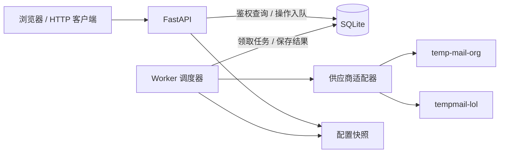
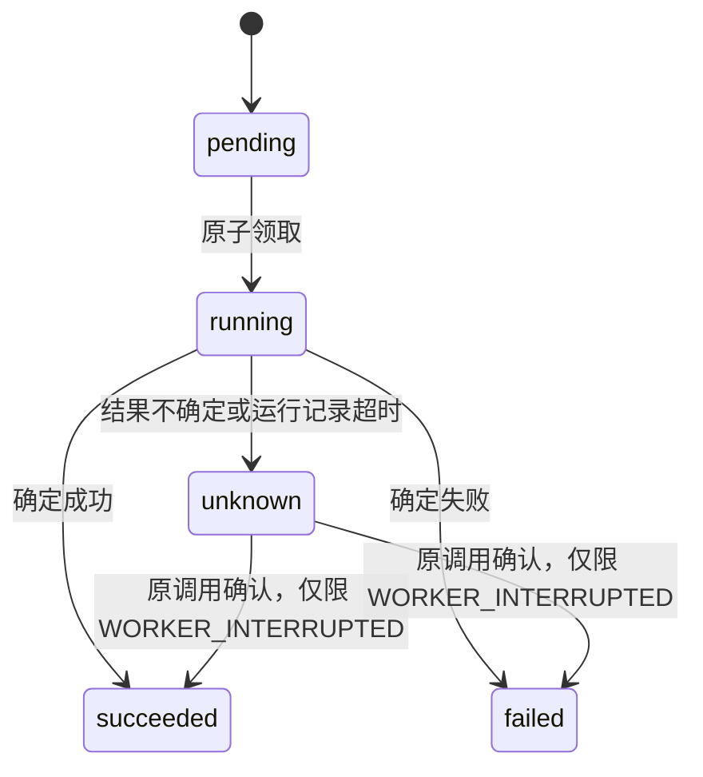

# 架构设计

本文说明服务边界、数据流和一致性约束。接口用法见 [API 参考](api.md)，参数与热更新规则见 [配置说明](configuration.md)；运行方式和页面交互分别见 [部署指南](deployment.md) 与 [前端说明](frontend.md)。

## 服务边界

Temp Mail 将多个供应商封装为统一的邮箱创建、收件和查询服务。当前接入 `temp-mail-org` 与 `tempmail-lol`，两者均仅支持收件；发送和远端删除保留通用契约，未声明能力的供应商会拒绝相应请求。

创建邮箱时确定供应商，随后所有上游操作始终使用该绑定。供应商不可用时记录错误，不迁移已有邮箱，也不自动为同一地址切换供应商。

API 采用单一管理令牌，当前服务主体固定为 `default`。令牌轮换不会改变邮箱归属；邮箱地址本身不提供访问权限。这里的“匿名”指无需向通信对象暴露真实邮箱，不承诺对供应商或部署方隐藏访问行为。

当前不提供多租户账户、附件、Webhook、分布式任务租约或供应商侧的无损收件保证。

## 架构

API 与 Worker 是独立进程，共享数据库、配置和加密密钥。API 完成鉴权、校验、查询及操作入队；Worker 执行上游请求并更新本地状态。查询邮件、操作和首页统计均读取本地数据，不触发供应商请求。

主要模块边界如下：

| 模块 | 职责 |
| --- | --- |
| `app/api.py`、`app/schemas.py` | HTTP 契约、鉴权、参数与响应模型 |
| `app/service.py` | 邮箱绑定、操作状态、缓存、生命周期与统计 |
| `app/worker.py` | 并发调度、任务补位与停止处理 |
| `app/db.py` | SQLite 事务、表结构与邮箱文件锁 |
| `app/runtime.py`、`app/config_store.py` | 配置快照、版本校验和原子保存 |
| `app/providers/` | 供应商协议、能力选择和响应转换 |

后端日志统一交给 Loguru，标准库和 Uvicorn 日志转入同一输出。日志不承担任务持久化职责，也不记录令牌、解密凭据或邮件正文。

## 数据模型

数据库使用 SQLite WAL。每次数据库操作建立独立连接，写入采用短事务；网络等待和邮件解析不持有全局写锁。

| 表 | 保存内容 | 关键约束 |
| --- | --- | --- |
| `mailboxes` | 本地邮箱 ID、地址、固定供应商、上游 ID、加密凭据、状态和时间 | `(provider_id, upstream_id)` 唯一 |
| `messages` | 已缓存邮件的摘要、正文、上游时间与本地缓存时间 | `(mailbox_id, upstream_id)` 唯一 |
| `message_batches` | 消费式收件尚未提交的加密原始响应及批次 ID | 每个邮箱最多一个待处理批次 |
| `operations` | 创建、发送、删除请求及执行结果 | `(owner_id, kind, idempotency_key)` 唯一 |

邮箱内部 ID 标识一次生命周期。地址可能被上游重新分配，不能据此覆盖旧记录或复用旧身份。按地址查询只做当前主体内的精确过滤；后续操作仍使用邮箱 ID。

供应商凭据与原始收件批次使用 Fernet 加密。已解析邮件缓存并非整体加密，部署方仍需保护数据库和备份。

操作记录独立于邮件缓存保留。发送操作保存请求和受理结果，但当前没有独立的已发送邮件夹；操作历史也没有自动清理策略。

## 固定绑定

新建邮箱的路由过程为：

1. 根据请求能力和有效期筛选已启用供应商。
2. `auto` 使用配置中的供应商顺序；显式指定供应商仍需通过能力校验。
3. 将已选 `provider_id` 与创建操作一起持久化。
4. Worker 再次校验该供应商，创建成功后保存邮箱绑定。

已有邮箱直接通过持久化的 `provider_id` 查找适配器，不根据地址域名推断供应商。配置顺序变化、禁用或移除供应商不会改写已有绑定；采用新配置的任务会报告原供应商不可用。

邮箱到期时间取以下两个时间中的较早值：

- 上游调用开始时间加请求的 `ttl_seconds`。
- 供应商返回的、带时区的到期时间；没有返回时只使用前者。

供应商的 `max_ttl_seconds` 控制本地收发期限，不延长上游保留时间。修改上限不追溯改变已有邮箱的到期时间。

## 幂等与操作状态

创建、发送和远端删除通过持久化操作队列执行。通过校验后，API 返回 `202 Accepted` 和操作对象，调用方按操作 ID 查询结果。

幂等范围包括主体、操作类型和 `Idempotency-Key`。请求摘要包含目标邮箱及有效载荷：同键同内容返回原操作，同键不同内容返回冲突。一次新的业务操作使用新的幂等键。

领取操作通过 SQLite 写事务完成，避免重复领取。同一 Worker 已经执行中的操作会从超时回收中排除。

超时不代表供应商没有执行。本地幂等只能防止重复入队，不能保证外部调用恰好执行一次。因此，`unknown` 不自动重新提交，也不通过更换供应商重做。

Worker 中断留下的过期 `running` 记录标记为 `unknown / WORKER_INTERRUPTED`。若原始调用稍后返回确定结果，允许该调用提交最终状态；其他 `unknown` 当前没有自动核实流程。

操作超时用于识别过期运行记录，不强制中断网络请求。发送成功仅表示供应商受理，不等同于收件人已收到邮件。

## Worker 并发

单个 Worker 进程使用两个独立线程池：

| 执行池 | 工作内容 | 并发配置 |
| --- | --- | --- |
| 操作池 | 创建，以及具备相应能力时的发送、远端删除 | `worker.create_concurrency` |
| 收件池 | 按邮箱完成一次收件同步 | `worker.receive_concurrency` |

主循环标记到期邮箱，按剩余槽位领取任务。网络请求在执行线程中完成，任务结束后唤醒调度器补位；同一任务不会重复进入本进程的执行池。

收件并发按邮箱计算。同一邮箱内部的邮件正文请求仍遵循适配器自身的处理顺序，不将每封邮件算作独立槽位。

并发上限支持热更新：提高后按新上限补位，降低时保留在途任务，待数量低于新上限再分配。任务开始时固定使用一个配置快照，后续配置变化不重放或中断该任务。

调度器在等待期间最多每秒检查一次配置。已有 `next_sync_at` 和错误退避计划保留，后续同步使用新参数。

一次性 `--once` 模式只分配一个有限批次，两个池各不超过配置并发数，等待其完成后退出，不表示排空队列。`Service.run_once()` 是串行兼容辅助方法，不是常驻 Worker 的调度入口。

并发限制以单进程为单位。当前部署继续使用一个 Worker；共享邮箱锁不等同于分布式队列或跨进程全局并发控制。

## 收件持久化

普通供应商返回统一的邮件列表，服务按邮箱与上游邮件 ID 去重，并在提交缓存时更新 `last_synced_at` 和下次同步时间。

消费式供应商的读取具有副作用：获取成功后，上游可能移除该批邮件。适配器必须将获取响应与解析响应分开，服务按以下顺序处理：

1. 优先读取该邮箱已保存的 `message_batches`。
2. 没有待处理批次时请求上游，将原始响应加密落盘。
3. 在数据库写事务外解密、解析该批次。
4. 在同一短事务中写入邮件缓存、更新同步状态并删除批次。

解析失败或最终缓存提交失败时保留批次，下次重放同一响应，不继续消费新邮件。没有上游邮件 ID 时，由稳定的批次 ID 和序号生成去重标识。

每个邮箱的完整同步周期持有独立文件锁。锁支持线程及共享数据库的进程互斥；未取得锁的任务跳过，取得锁后再次检查同步时间，避免使用过期调度列表重复查询。

锁文件位于数据库路径追加 `.mailbox-locks` 的目录，以邮箱 ID 摘要命名。共享数据库的进程也必须共享该目录。解锁不删除文件，避免 inode 变化破坏互斥；进程退出后操作系统释放锁。

同步失败采用指数退避，最长间隔为一小时；成功后恢复正常周期。错误只影响原绑定邮箱，不触发供应商迁移。

原始响应持久化不能消除所有风险：上游已经消费但响应丢失，或收到响应后尚未落盘就中断，仍可能丢失邮件。同一上游凭据不得同时用于其他消费者。

## 到期与清除

| 邮箱状态 | 收发行为 | 本地读取 |
| --- | --- | --- |
| `active` 且未到期 | 按能力执行 | 可读取 |
| `expired` 或已到达有效期 | 停止收发与批次解析 | 已缓存邮件只读 |
| `deleted` | 禁止操作 | 详情与邮件返回 `410` |
| 已确认清除 | 不再保留邮箱记录 | 返回 `404` |

Worker 到期处理只标记 `expired` 并清除上游凭据，保留邮箱元数据、已缓存正文和待处理批次。即使 Worker 尚未标记，业务层也按到期时间拒绝发送和同步。

过期邮箱的读取依赖本地缓存，不需要上游凭据。未解析批次继续保留，但不会在过期后恢复解析；只有已经提交到 `messages` 的邮件可供读取。

“清除失效邮箱”使用预览与确认两步。预览计算当前主体的完整待清除集合，返回数量、截止时间和集合版本，不受列表分页或搜索条件影响。

确认时在同一写事务重新核对数量和集合版本；发生变化返回 `CLEANUP_CHANGED`，需要重新确认。固定截止时间避免把确认期间新到期的邮箱一起删除。

清除只处理本地数据：删除邮箱、邮件和暂存批次，保留操作历史及原始结果，将操作的 `mailbox_id` 关联置空。收件提交前再次检查邮箱存在性和有效期，防止清除后重建缓存或在到期后覆盖旧缓存。

通用远端删除是另一条操作路径：只有原供应商确认成功才更新本地状态并清理缓存；当前两家供应商均不支持。确认清除也不等于抹除供应商远端数据、备份、操作历史或 SQLite 的物理存储内容。

## 统计口径

首页统计从同一 SQLite 读事务生成，按当前主体隔离，不访问供应商，不读取邮件正文、上游凭据或操作原始载荷。

| 指标 | 口径 |
| --- | --- |
| 邮箱总数 | 全部留存邮箱，包含过期和已删除元数据 |
| 有效邮箱 | 状态为 `active` 且到期时间晚于统计时间 |
| 过期邮箱 | 已标记过期，或状态仍有效但已到期 |
| 同步异常 | 当前有效邮箱中有最近同步错误码的数量 |
| 邮件总数 | 当前主体未删除邮箱的缓存邮件，包含过期邮箱 |
| 最近 24 小时新增缓存 | 按 `cached_at` 统计，不使用上游邮件日期 |
| 操作状态 | 全部持久化操作，不受当前列表页影响 |
| 最近操作 | 按 `updated_at DESC, id DESC` 取 3 条 |
| 最近同步时间 | 未删除邮箱中最近一次成功同步时间 |
| 供应商分布 | 按绑定供应商汇总留存邮箱总数及当前有效数 |

趋势覆盖最近七个 UTC 自然日，以 `created_at` 统计邮箱、以 `cached_at` 统计邮件，按日期升序补零，不计入统计时间之后的数据。

邮箱到期不减少已缓存邮件计数；确认清除后邮箱和邮件计数减少，操作数量保留。同步时间与错误数量是历史观测，不构成 Worker 存活检查。

## 配置一致性

API 与 Worker 使用完整的运行配置快照。配置保存先校验文件版本与参数，再原子替换文件，成功后应用新快照；保存失败不会切换运行配置。

API 为每个请求固定快照，保证鉴权与业务逻辑使用同一配置。Worker 为每个任务固定快照，后续任务采用更新后的配置。外部文件无效时保留上一份有效快照。

数据库路径与加密密钥保留进程启动值，变更需要协调重启；不会自动迁移数据库或重新加密已有凭据。完整参数、敏感值处理和生效规则集中在 [配置说明](configuration.md)。

## 扩展供应商

适配器实现 `app/providers/base.py` 中的协议，声明真实支持的能力，并将远端数据转换为统一模型：

| 方法 | 返回与职责 |
| --- | --- |
| `create_mailbox` | 返回上游 ID、地址、凭据及可选的到期时间 |
| `list_messages` | 返回统一 `ProviderMessage` 列表 |
| `send_message` | 提交发件并返回上游标识 |
| `delete_mailbox` | 在确认远端删除成功后返回 |

消费式适配器额外实现 `fetch_messages` 和 `parse_messages`，将有副作用的网络读取与纯解析分离。协议当前一次返回邮件列表，远端分页由适配器处理，尚无通用增量游标。

`ProviderError` 必须区分明确失败和结果不确定。只有供应商确实支持时，才能依赖上游幂等键或结果查询；本地请求 ID 不能替代远端保证。

接入时需要同时补充配置校验、注册入口、离线测试和供应商说明。测试应覆盖能力选择、固定绑定、重复处理、到期、消费批次恢复与失败语义。

兼容现有能力的供应商无需改写 HTTP API；新增附件、Webhook 等能力则需同步扩展协议、数据结构和接口。现有适配器的具体约束见 [temp-mail.org](providers/temp-mail-org.md) 与 [TempMail.lol](providers/tempmail-lol.md)。
