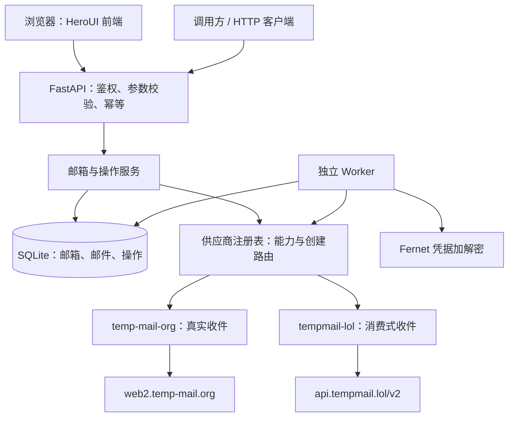
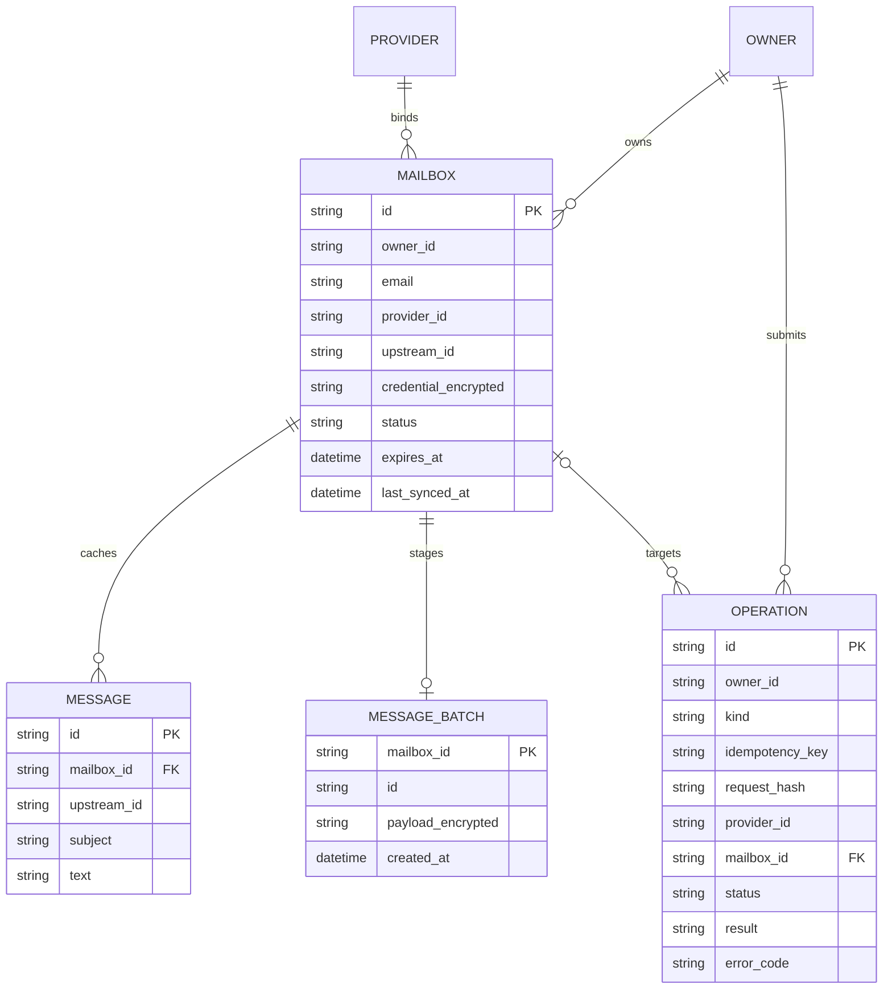
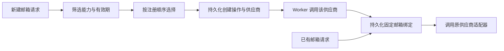
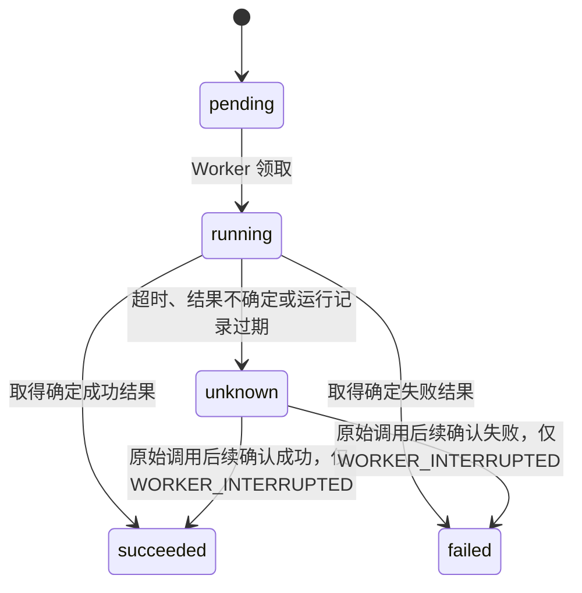
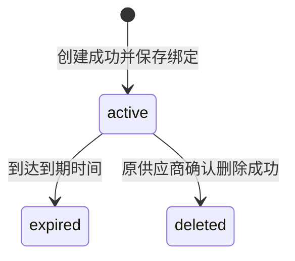

# 匿名邮箱聚合服务设计

## 1. 目标与约束

服务对外提供统一的邮箱创建和收件接口，并保留通用发件、删除契约。当前接入的 `temp-mail-org`、`tempmail-lol` 均仅支持收件，发件和删除请求返回能力错误。调用方使用本服务的邮箱 ID、邮件格式及操作状态，不直接接触供应商凭据。

本项目采用固定绑定：创建新邮箱时选择供应商，创建成功后将绑定持久化。后续对该邮箱的所有操作只调用原供应商。原供应商不可用时保留绑定，返回或记录错误；不迁移邮箱，不为已有地址选择其他供应商。

“匿名”指调用方无需向通信对象暴露自己的真实邮箱，当前框架不承诺对供应商或部署方隐藏访问行为。API 使用令牌控制访问；知道一个邮箱地址并不代表获得访问权。

## 2. 当前实现与供应商范围

| 项目 | 当前实现 |
| --- | --- |
| HTTP 服务 | FastAPI，版本前缀 `/v1` |
| 网页前端 | HeroUI 3、React 19、TypeScript、Vite 8、Tailwind CSS 4，pnpm 管理依赖 |
| 持久化 | SQLite，共享数据库文件 |
| 后台任务 | 独立 Worker，持久化操作队列与周期收件同步 |
| 鉴权 | HTTP Bearer，单服务主体 `default` |
| 凭据保护 | Fernet 加密供应商凭据 |
| 供应商 | `temp-mail-org`、`tempmail-lol`，均为真实创建与收件 |
| 邮件传递 | 从真实供应商同步收件，当前不支持外发 |
| 未实现 | 真实供应商发件、附件、Webhook、SSE、多租户、完整配额、数据库迁移 |

供应商持有远端邮箱与邮件，本服务在 SQLite 中保存绑定、操作及收件缓存。Fernet 保护绑定凭据和待处理收件批次，邮件缓存并非整体加密存储。

`temp-mail-org` 使用网站内部接口和逐邮箱令牌，没有经过验证的远端删除协议或上游有效期。请求的 `ttl_seconds` 只限制本地访问期限。详见 [接入说明](providers/temp-mail-org.md)。

`tempmail-lol` 使用 v2 API，免费邮箱请求有效期不超过 3600 秒，仅支持收件。它声明 `destructive_receive: true`：上游读取会消费邮件，需要本地加密暂存与单一消费者。详见 [接入说明](providers/tempmail-lol.md)。

## 3. 架构与模块边界



API 负责鉴权、校验、访问隔离、查询和操作入队；不在请求中等待远端创建或发件。Worker 消费队列、调用适配器、保存结果并同步收件。API 和 Worker 共用数据库、加密密钥及配置。

前端使用相同的 `/v1` 契约，负责登录、供应商与有效期选择、创建状态轮询、分页列表和纯文本邮件阅读。每 5 秒刷新的是本地收件缓存，不会直接调用供应商或改变 Worker 的上游同步周期。创建结果为 `unknown` 时不自动重新提交。前端不包含供应商凭据，也不承担后台同步职责；具体开发与交互约定见 [前端说明](frontend.md)。

供应商注册表负责新邮箱的能力筛选和路由。已有邮箱通过持久化的 `provider_id` 获取适配器，使用上游邮箱 ID 和解密凭据调用远端；不根据 email 域名推断供应商。

目录结构：

```text
main.py                 FastAPI 入口
frontend/               HeroUI + React 前端，使用 pnpm
  src/                  页面、API 客户端与样式
  dist/                 pnpm build 产物，由 API 提供，不提交版本库
  pnpm-lock.yaml        前端依赖锁文件
app/
  api.py                HTTP 路由、鉴权和错误转换
  schemas.py            请求与响应模型
  config.py             YAML 配置读取与校验
  db.py                 SQLite 建表与事务
  service.py            固定绑定、操作执行、收件同步和生命周期
  worker.py             后台循环与 --once 入口
  errors.py             业务错误类型
  providers/
    base.py             适配器协议和统一供应商模型
    registry.py         供应商注册和创建时选择
    factory.py          API 与 Worker 共用的配置化注册入口
    message_text.py     共享的 HTML 邮件转纯文本逻辑
    temp_mail_org.py    temp-mail.org 网站接口适配器
    tempmail_lol.py     TempMail.lol v2 接口适配器
tests/                  API 与核心行为验证
  fakes.py              仅用于离线测试的供应商替身
docs/design.md          本文档
test_main.http          手工调用示例
config.example.yaml     配置模板
```

## 4. 核心数据模型



此图表达领域关系；`OWNER` 和 `PROVIDER` 当前分别由固定主体及注册配置表示，不代表已经实现多租户账户表或供应商管理后台。

### 4.1 邮箱绑定

邮箱必须保存自己的 ID、完整 email、供应商 ID、上游邮箱 ID、加密凭据、归属、状态和到期时间。内部 ID 标识一次邮箱生命周期，是收发和删除接口的主键。

按 email 查询只在已授权主体的记录内进行精确过滤。调用方拿到邮箱 ID 后继续使用 ID；地址本身不能替代鉴权或跨生命周期身份。过期地址未来可能再次分配，不应覆盖旧记录并沿用旧 ID。

令牌轮换只改变请求凭证；当前 `owner_id` 固定为 `default`，不从令牌推导，避免轮换后旧邮箱无法访问。此模式适用于单个受信任服务调用方，尚不能给多个互不信任用户分别授权。

### 4.2 邮件缓存

供应商邮件转换为本地记录，以 `(mailbox_id, upstream_id)` 去重；没有上游 ID 时由适配器生成稳定标识。缓存只保存收件，尚无独立的已发送邮件夹。

邮件列表提供 `last_synced_at`，表示缓存最近一次成功同步的时间。

`message_batches` 保存消费式收件的原始响应，使用 Fernet 加密并关联邮箱。成功解析后，写入 `messages` 与删除对应批次在同一事务提交；失败保留批次。邮箱到期时一并清理暂存批次。

### 4.3 操作记录

创建、发送、删除操作都进入同一持久化队列。记录请求摘要、供应商、目标邮箱、状态、结果和错误码，用于幂等重试与结果查询。

创建操作入队时尚无邮箱 ID；Worker 在供应商创建成功后保存绑定，再将邮箱 ID 和地址写入操作 `result`。

历史操作尚无自动清理策略，请求内容、结果及幂等记录会独立于邮箱缓存保留。

## 5. 供应商能力与路由

每个适配器声明收件、发件等能力，以及支持的有效期约束。创建请求显式描述所需能力：

```json
{
  "provider": "auto",
  "required_capabilities": ["receive"],
  "ttl_seconds": 3600
}
```

`auto` 按 `config.yaml` 中 `providers` 的键顺序筛选已启用的供应商；模板顺序为 `temp-mail-org`、`tempmail-lol`。只有配置中列出的供应商会注册，`enabled` 默认 `true`。显式指定供应商时仍检查能力与有效期；没有匹配项就拒绝请求。



创建操作持久化后沿用已选供应商；不能通过重新路由重做结果未知的创建请求。

Worker 执行创建前再次检查已选供应商的能力与有效期，不重新选择供应商。邮箱到期时间取“调用开始时间 + 请求有效期”与供应商返回到期时间中的较早值；供应商未返回时使用前者。

## 6. 异步写操作与幂等

### 6.1 对外协议

创建、发送、删除要求 `Idempotency-Key` 请求头，通过能力和参数校验后返回 `202 Accepted` 和操作对象。调用方通过 `GET /v1/operations/{id}` 查询最终状态。不支持的能力在入队前返回错误。

操作对象包含 `id`、`kind`、`status`、`provider_id`、`mailbox_id`、`result`、`error_code`、`created_at`、`updated_at`。字段为空时返回空值；请求刚入队时 `result` 通常为空。

幂等作用域为 `(owner_id, kind, idempotency_key)`，请求摘要包括目标邮箱及有效载荷。相同键和相同内容返回原操作；相同键但不同内容返回 `409`。新的一次业务操作必须使用新键。

本地幂等保证本服务不因 HTTP 重试重复入队，不能单独保证外部供应商恰好执行一次。

### 6.2 操作状态机



| 状态 | 含义 | 当前处理 |
| --- | --- | --- |
| `pending` | 已持久化，等待 Worker | 可由 Worker 领取 |
| `running` | 已领取，正在执行 | 等待结果 |
| `succeeded` | 已取得确定成功结果 | 查询 `result` |
| `failed` | 已取得确定失败结果 | 查询 `error_code` |
| `unknown` | 无法确认远端是否已执行 | 不自动重放 |

响应超时不代表远端未执行，自动重放可能重复创建邮箱或发送邮件。此类操作保留为 `unknown`；Worker 崩溃留下的超时 `running` 记录也转为 `unknown`，不重新入队。

标记为 `WORKER_INTERRUPTED` 后，若原始调用仍在执行，可以根据该次调用后续的确定响应更新为成功或失败，不发起新请求。其他 `unknown` 尚无自动核实或人工修复接口。操作超时阈值应覆盖适配器请求期限；它只用于识别过期运行记录，不会强制中断阻塞调用。

通用发件契约中的成功表示供应商已受理，没有投递回执时不代表邮件已经送达。

## 7. 收件同步与邮箱生命周期

Worker 定期查询活跃邮箱，按固定绑定调用适配器，转换并去重保存邮件，成功后更新同步时间。API 查询本地缓存，不在每次列表请求中轮询供应商。

对于 `destructive_receive` 供应商，Worker 优先处理 `message_batches` 中已有的加密响应，没有暂存批次时才读取上游并保存原始响应。解析异常会保留批次并阻止继续拉取，待修复后重试原批次，避免反复消费新邮件。

消费式读取期间持有 SQLite 写事务，串行化共享同一数据库的消费者，同时会阻塞其他数据库写入；适配器为网络请求设置超时，部署按单 Worker 使用。上游已消费但响应在网络中丢失，或收到响应后首次暂存失败，仍可能无法恢复，不能保证无损收件。同一上游令牌不得同时交给浏览器或其他消费者使用。

同步失败后指数退避，最长间隔 3600 秒；成功时恢复配置的同步间隔。邮箱元数据保存最近同步错误码，后续周期继续处理原绑定或暂存批次。写操作的 `unknown` 不因周期轮询重新执行。

每次 Worker 循环先处理到期邮箱，再领取至多一个操作，随后同步至多 20 个到期需要同步的邮箱。`--once` 只执行这个循环一次，不表示排空队列。



到期处理停止邮箱访问，清理本地正文、暂存批次及绑定凭据，不代表上游已经删除。通用删除契约只有在原供应商确认成功后才更新本地状态并清理缓存；当前两家供应商不支持此操作。

当前本地过期清理不等价于彻底抹除所有数据：历史操作、供应商远端数据、备份以及 SQLite 文件的物理存储需要各自的保留与清理策略。

## 8. HTTP 接口

业务接口统一要求 `Authorization: Bearer <token>`。健康检查公开。

| 方法 | 路径 | 功能 |
| --- | --- | --- |
| GET | `/health/live` | API 进程存活检查 |
| GET | `/health/ready` | 服务就绪检查 |
| GET | `/v1/capabilities` | 查询已注册供应商的能力 |
| POST | `/v1/mailboxes` | 异步创建邮箱，需要幂等键 |
| GET | `/v1/mailboxes` | 查询邮箱，支持 `limit`、`offset`、`email` 精确过滤 |
| GET | `/v1/mailboxes/{id}` | 查询单个邮箱及固定绑定信息 |
| DELETE | `/v1/mailboxes/{id}` | 保留的异步删除契约；当前供应商不支持 |
| GET | `/v1/mailboxes/{id}/messages` | 查询邮件列表，支持 `limit`、`offset` |
| GET | `/v1/mailboxes/{id}/messages/{message_id}` | 查询邮件正文 |
| POST | `/v1/mailboxes/{id}/messages` | 保留的异步发件契约；当前供应商不支持 |
| GET | `/v1/operations/{id}` | 查询已提交操作 |

分页默认 `limit=50`、`offset=0`，`limit` 范围为 1–100；响应使用 `items`、`limit`、`offset`，邮件列表额外提供 `last_synced_at`。邮件摘要不含正文，详情额外提供 `text`。邮箱列表保留过期和已删除记录的元数据；这些邮箱的详情及邮件读取返回 `410`。

创建有效期范围为 60–86400 秒，供应商可进一步收紧上限。发件收件人数量为 1–50，主题最多 998 字符且不能含换行，正文为 1–1000000 字符。幂等键为 1–200 字符且不能只有空白。

能力查询返回 `providers` 数组，每项包含 `id` 和 `capabilities`。邮箱详情不会返回上游凭据。

接口校验及响应结构以 `/openapi.json` 为准。HTTP `202` 仅表示入队，后续结果通过操作资源的 `status` 与 `error_code` 表达。

### 错误分类

| 场景 | 表达方式 |
| --- | --- |
| 缺失或无效访问凭证 | `401 / UNAUTHORIZED` |
| 请求参数不合法 | `422 / VALIDATION_ERROR` |
| 找不到邮箱、邮件或操作 | `404 / MAILBOX_NOT_FOUND`、`MESSAGE_NOT_FOUND`、`OPERATION_NOT_FOUND` |
| 同一幂等键提交不同内容 | `409 / IDEMPOTENCY_CONFLICT` |
| 邮箱已过期或删除 | `410 / MAILBOX_EXPIRED`、`MAILBOX_DELETED` |
| 供应商不支持请求能力或有效期 | `422 / CAPABILITY_UNSUPPORTED`、`TTL_UNSUPPORTED` |
| 绑定供应商未配置 | `503 / PROVIDER_UNAVAILABLE` |
| 数据库存储暂不可用 | `503 / STORAGE_UNAVAILABLE` |
| 确定的供应商失败 | 操作 `failed` 或同步错误记录 |
| 供应商结果不确定 | 操作 `unknown` |

同步 HTTP 错误统一返回 `{"error": {"code": "...", "message": "..."}}`；参数错误还包含不带输入值的 `details`。操作失败通过操作资源返回，不改写成 HTTP 错误。

内部错误应转换为稳定业务错误，不把供应商凭据或底层异常堆栈返回给调用方。

## 9. 配置、部署与运维边界

服务从当前工作目录读取 `config.yaml`，不读取 `.env` 或 `TEMP_MAIL_*`。`app` 配置数据库、API 令牌及加密密钥，`worker` 配置同步和操作超时，`providers` 按供应商 ID 配置启用状态及连接参数。`app` 和 `providers` 必填，`worker` 可省略。相对数据库路径基于配置文件目录解析，API 令牌至少 24 字符。使用已有数据库时须保留原路径和加密密钥，否则无法访问原数据或解密绑定凭据。

初始部署使用一个 API 进程、一个 Worker 进程及本地 SQLite 文件。API 和 Worker 的工作目录、数据库路径及密钥必须一致。本地可通过 `uv run python run.py` 统一管理两个进程，按 Ctrl+C 同时停止；一个进程意外退出时，入口停止另一个并以非零状态退出。`--reload` 只重载 API，Worker 始终保持单个进程。API 就绪不代表 Worker 正在执行任务。

Docker Compose 使用同一镜像分别运行 API 和 Worker，并共享只读配置与持久化数据目录。镜像多阶段构建先通过 pnpm 生成前端静态文件，再放入 Python 运行镜像，由 API 在 `/` 提供页面，保留 `/v1`、`/health`、`/docs` 与 `/openapi.json`。浏览器与 API 同源，无需独立前端容器。首次配置、启动、升级和停机备份步骤见 [Docker 部署文档](deployment.md)。

网页使用 `app.api_token` 登录，只将令牌保存在当前标签页的 `sessionStorage`，退出时清除。该登录方式沿用单服务主体模型，没有新增用户账户或租户隔离。加密密钥、数据库路径与供应商连接配置仍只由后端读取，前端构建无需这些配置。

`providers.<id>.index_url` 是可选的网站入口说明，例如 `temp-mail-org` 的 `https://temp-mail.org/zh/`；它不参与路由、网络调用或适配器参数。`base_url` 仍用于实际 API 请求。

API 与 Worker 使用同一注册构建入口。每个供应商通过 `providers.<id>` 配置 `base_url`、`timeout_seconds`、`impersonate` 和 `proxy`。`proxy` 为代理 URL，支持 HTTP(S)、SOCKS 及 URL 内认证；省略、`null` 或空字符串会保留 curl_cffi 的环境代理行为，不保证直连。显式代理失败返回供应商错误，不自动切换直连。配置文件可能含代理凭据，应限制访问权限并排除版本控制。

当前两家供应商无需共享 API Key 或 Cookie，逐邮箱令牌由业务层加密持久化。移除或禁用供应商会使其已有绑定无法继续同步；配置修改后需重启 API 和 Worker。

常驻 Worker 遇到 SQLite 操作错误时记录错误并在下轮重试；`--once` 遇到同类错误以非零状态退出。

当前不提供分布式任务租约、完整心跳监控或生产容量保证，不能直接按增加 Worker 数量扩展消费式收件吞吐量。

运维关注操作排队时间、运行时长、`unknown` 数量、同步延迟及供应商错误；这些指标尚未集成为监控系统。日志不应记录令牌、解密凭据或邮件正文。

## 10. 接入真实供应商

适配器实现 `app/providers/base.py` 中的 `Provider` 协议：

| 成员 | 职责 |
| --- | --- |
| `id`、`capabilities` | 稳定供应商标识与能力声明 |
| `create_mailbox(ttl_seconds, request_id)` | 创建邮箱，返回 `ProviderMailbox` |
| `list_messages(mailbox)` | 列出收件，返回 `ProviderMessage` 列表 |
| `send_message(mailbox, recipients, subject, text, request_id)` | 提交发件，返回上游发送标识 |
| `delete_mailbox(mailbox, request_id)` | 删除远端邮箱，确定成功后返回 |

`ProviderError(code, message, uncertain)` 区分明确失败与不确定结果。当前协议一次返回收件列表，分页由适配器内部处理，尚无通用增量游标。

消费式供应商还需实现 `DestructiveReceiveProvider` 的 `fetch_messages(mailbox)` 与 `parse_messages(mailbox, payload, batch_id)`，将有副作用的读取与纯解析分开。无上游邮件 ID 时使用稳定的批次 ID 和批次内序号生成去重标识，重试保留同一批次 ID。

1. 确认创建、收件、发件、删除、有效期及聚合使用要求，只声明已实现的能力，并识别读取是否消费邮件。
2. 实现适配器，将邮箱、邮件和错误转换为统一结构。创建结果返回上游 ID、凭据及可选的带时区 `expires_at`，由业务层保存固定绑定。
3. 设置请求超时，明确失败与未知结果；仅在供应商确实支持时使用上游幂等键或结果查询。
4. 加入配置校验与注册入口，验证已声明能力、重复处理、过期、暂存恢复及失败语义。
5. 文档说明限流、邮件保留、删除保证和已知限制，不将供应商未保证的行为作为服务承诺。

无需改写 HTTP API 即可接入兼容现有能力的供应商。附件、Webhook 等新增能力需要同时扩展适配器协议、数据结构与对外接口，不能仅在供应商内部静默支持。
